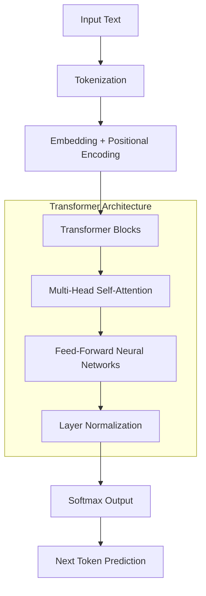

## Understanding Large Language Models: Architecture and Function

To understand how artificial intelligence systems reason, we must first establish the empirical foundation of what a Large Language Model (LLM) is and how it processes information. A Large Language Model is a deep neural network typically containing over one billion—and often tens to hundreds of billions—parameters [1][2]. These models represent a paradigm shift in computational linguistics, moving away from explicit rule-based programming toward probabilistic pattern recognition on an unprecedented scale.

The development of LLMs is fundamentally anchored in the "pre-training and fine-tuning" paradigm [1]. During the pre-training phase, these models undergo self-supervised learning on massive amounts of unsupervised text data scraped from the internet, books, and conversational datasets [5][6]. This exposure allows the neural network to empirically observe and internalize the syntax, semantics, rules, and underlying world knowledge embedded within human language [5][7]. Following this broad pre-training, the models can be fine-tuned using supervised data to specialize in specific downstream tasks or align with human preferences. Furthermore, modern LLMs demonstrate the ability to perform tasks "zero-shot" using natural language instructions, bypassing the need for task-specific retraining [4].

As the parameter scale and training data volume of these models grow, they exhibit what researchers term "emergent abilities"—such as advanced logical reasoning, mathematical problem-solving, and in-context learning—allowing them to act as highly capable general-purpose assistants [8].

### The Transformer Architecture

Modern LLMs have fundamentally moved away from traditional Recurrent Neural Networks (RNNs) and Convolutional Neural Networks (CNNs) in favor of the Transformer architecture, which was introduced in 2017 [12]. The Transformer architecture provides several foundational advantages that make large-scale reasoning possible:

1. **Self-Attention Mechanism**: Instead of processing text sequentially like RNNs, the Transformer uses an attention mechanism to globally establish connections between every word in a sequence simultaneously [12][15]. This enables the model to weigh the importance of different words regardless of their physical distance from each other in the text, effectively capturing long-range contextual relationships [16][17].
2. **Parallel Processing**: Unlike RNNs, which possess a temporal dependency chain that causes sequential bottlenecks, Transformers are "stateless" and process all input tokens simultaneously [16][18]. This extreme parallelizability makes them exceptionally suited for training on massive datasets using GPU clusters [16].
3. **Structural Variants**: LLMs are primarily built on either an Encoder-Decoder architecture (like T5 and BART) or a Decoder-only architecture (like the GPT series and LLaMA) [20]. In the dominant Decoder-only setup, the model relies on masked self-attention, meaning each token can only attend to prior contextual information to perform unidirectional computation [23].

### Fundamental Operational Workflow

At their most fundamental level, LLMs function as advanced statistical engines designed to model the probability distribution of language [24][25]. The basic operational workflow that enables their apparent reasoning capabilities includes:

| Phase | Empirical Process | Theoretical Purpose |
|-------|------------------|---------------------|
| **Tokenization and Embedding** | The model breaks free-form text down into tokens. These tokens pass through embedding layers, mapping words into dense numerical vectors. | Encapsulates deep semantic relationships and linguistic context into a mathematical space [17]. A positional embedding is added to retain sequential order [23]. |
| **Autoregressive Generation** | The embedded inputs pass through multiple layers of multi-head attention and feedforward networks to extract deep features. | The core pre-training task is language modeling—predicting the next word based on preceding context [7][24][13]. |
| **Probabilistic Output** | The model computes a probability distribution over its entire vocabulary to determine the most likely next token. | It maximizes the conditional probability of the sequence, generating responses one token at a time in an autoregressive loop until complete [25][27][22]. |

Through this intricate statistical dance of embeddings, attention mechanisms, and probability distributions, LLMs construct the illusion of comprehension. However, the true mechanics of their reasoning extend far beyond mere next-word prediction, delving into structured thought processes, environmental interaction, and high-dimensional latent space manipulations, which we shall explore in the subsequent sections.
