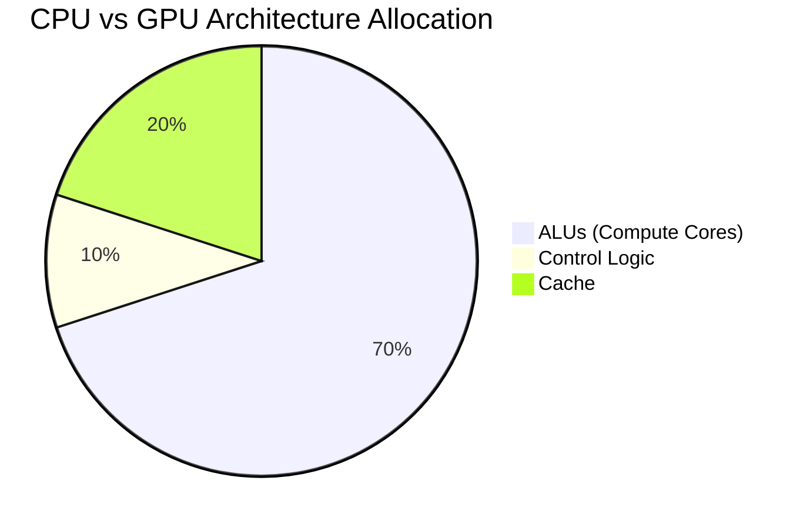
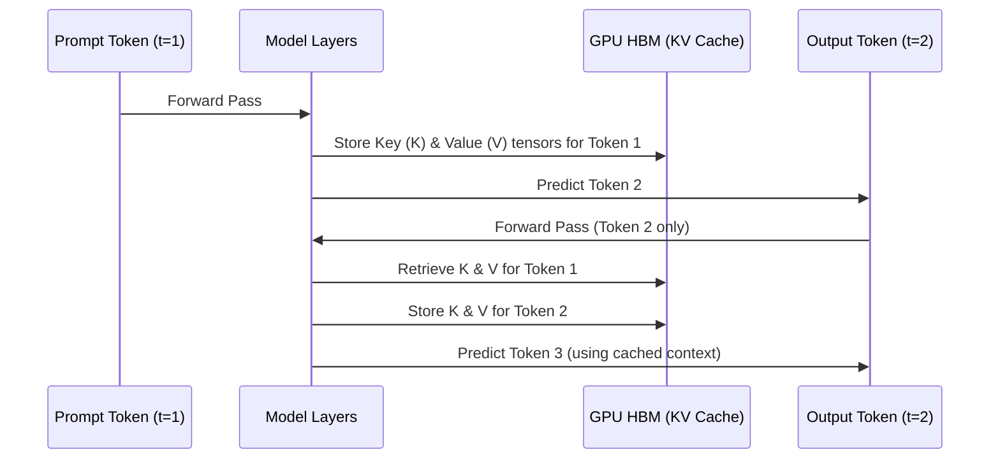

## Hardware Foundations of LLM Reasoning

The abstract geometry of an LLM is tethered to an incredibly demanding physical reality. The sheer scale of modern LLMs—ranging from 7 billion to over 1 trillion parameters—means that reasoning is not merely an algorithmic challenge; it is a massive hardware orchestration problem. The capacity of an LLM to reason is strictly bounded by the silicon it runs on.

### The Domination of the GPU

Unlike traditional deterministic software, which executes sequential logic efficiently on Central Processing Units (CPUs), LLMs rely entirely on Graphics Processing Units (GPUs) or specialized Tensor Processing Units (TPUs). 

A CPU is designed to execute complex, varied instructions quickly, typically possessing 16 to 64 highly capable cores. A modern data center GPU, such as the NVIDIA H100, possesses tens of thousands of smaller, specialized cores designed specifically to execute floating-point math in massive parallel arrays.

*(In a GPU, the vast majority of die space is dedicated to Arithmetic Logic Units (ALUs) for parallel compute, whereas CPUs dedicate significant space to complex control logic and large caches.)*

When an LLM "reasons," it is performing billions of matrix multiplications. Every token passed through every layer of the Transformer requires calculating attention scores and passing vectors through feed-forward networks. The GPU’s architecture allows these independent calculations to occur simultaneously across thousands of cores.

### The Memory Wall: Bandwidth over Compute

While FLOPs (Floating Point Operations Per Second) are a critical metric, the true physical bottleneck of LLM reasoning is **Memory Bandwidth**. 

During inference (the act of generating text), the model’s parameters (its weights) must be loaded from the GPU's High Bandwidth Memory (HBM) into the compute cores for *every single token generated*. 

| Hardware Component | Metric | Capacity / Speed | Implication for LLMs |
| :--- | :--- | :--- | :--- |
| **NVIDIA A100 (80GB)** | Memory Capacity | 80 GB HBM2e | Can hold a ~40B parameter model (at 16-bit precision). |
| **NVIDIA A100 (80GB)** | Memory Bandwidth | 2.0 TB/s | The speed at which parameters can be moved to compute cores. |
| **NVIDIA H100 (80GB)** | Memory Bandwidth | 3.3 TB/s | Allows for significantly faster token generation due to reduced memory bottlenecks. |

If a model has 100 billion parameters stored in 16-bit precision, it occupies 200 GB of memory. To generate one token, the GPU must theoretically read 200 GB of data. If the memory bandwidth is 2 TB/s, the absolute physical limit of the system is 10 tokens per second—even if the compute cores are sitting idle waiting for data. This phenomenon is known as the **Memory Wall**.

### The Key-Value (KV) Cache: The Working Memory of Reasoning

As an LLM generates a response, it must maintain the context of the user's prompt and all the tokens it has generated so far. In a naive implementation, the model would have to recalculate the attention scores for the entire sequence from scratch every time it wanted to predict the next word. This is computationally impossible for long contexts.

To resolve this, hardware implementations utilize a **Key-Value (KV) Cache**.

During the attention calculation, the model generates Query (Q), Key (K), and Value (V) matrices. Instead of discarding the Keys and Values after a token is processed, the system stores them in the GPU's HBM. When generating the next token, the model only computes the Query for the *new* token and compares it against the *cached* Keys and Values of all previous tokens.

The KV Cache acts as the LLM's short-term working memory. However, this cache grows linearly with the sequence length. A 100,000-token context window can consume tens of gigabytes of VRAM strictly for the KV cache. When the KV cache exceeds the available memory, reasoning fails, or the system must offload to slower CPU RAM, destroying generation speed.

### Multi-GPU Orchestration

Because the parameters and KV cache of frontier models (like GPT-4 or Gemini 1.5 Pro) vastly exceed the 80-144 GB capacity of a single GPU, reasoning must be distributed across massive clusters. Techniques like **Tensor Parallelism** (splitting a single matrix multiplication across multiple GPUs) and **Pipeline Parallelism** (putting different layers of the model on different GPUs) are employed. 

This requires an ultra-high-speed interconnect fabric (like NVLink), allowing GPUs to share memory and compute results with microsecond latency. Thus, advanced reasoning is not just an algorithmic feat; it is the culmination of bleeding-edge materials science, memory architecture, and networking infrastructure.