## Mechanisms of Reasoning: Attention and In-Context Learning

Having established the probabilistic nature of the Transformer and the physical hardware that powers it, we must ask: how does a system that merely predicts the next word actually *reason*? The answer lies in the empirical mechanics of the Attention mechanism acting as dynamic circuits, enabling a phenomenon known as In-Context Learning.

### The Mathematics of Attention

At the heart of the Transformer's reasoning capability is the Scaled Dot-Product Attention function. This mathematical operation allows the model to dynamically route information and compare concepts.

```python
# Pseudo-code representation of Scaled Dot-Product Attention
def attention(query, key, value, d_k):
    # 1. Calculate similarity between queries and keys
    scores = dot_product(query, transpose(key))
    
    # 2. Scale down to prevent vanishing gradients
    scaled_scores = scores / sqrt(d_k)
    
    # 3. Apply softmax to get normalized probabilities (attention weights)
    attention_weights = softmax(scaled_scores)
    
    # 4. Multiply weights by the values to get the final context vector
    output = dot_product(attention_weights, value)
    
    return output
```

When a user poses a logical puzzle, the **Query** represents the current token the model is analyzing, the **Keys** represent the identities of all other tokens in the context, and the **Values** represent the underlying semantic meaning of those tokens. 

If the prompt is: *"The CEO of Microsoft is Jensen Huang. The CEO of Apple is Satya Nadella. Wait, that's wrong. The CEO of Microsoft is..."*

The model's attention mechanism uses the final "is" as the Query. It compares this Query against the Keys of previous tokens. Because of its training, it recognizes the pattern of correction ("Wait, that's wrong"). The attention weights heavily prioritize the semantic Values associated with "CEO of Microsoft" while actively suppressing the hallucinated "Jensen Huang" from the earlier sentence. The Feed-Forward Network then translates this localized, highly weighted context into the statistically correct output: "Satya Nadella."

### In-Context Learning and Induction Heads

The most profound empirical observation regarding LLM reasoning is **In-Context Learning (ICL)**. ICL is the ability of an LLM to learn a new task at inference time—without any changes to its underlying weights—simply by observing examples provided in the prompt.

If you provide an LLM with three examples of an obscure, newly invented logical rule (e.g., "If an object is a Blargh, it is blue. A Glorp is a Blargh. Therefore, a Glorp is blue."), and then ask it to solve a fourth, it will generally succeed. 

Researchers (such as those at Anthropic) have identified specific structures within the attention layers responsible for this: **Induction Heads**.

```mermaid
graph LR
    A[Token A] -- occurs before --> B[Token B]
    C[Later occurrence of Token A] -- Induction Head triggers --> D[Predicts Token B]
    
    style A fill:#333,stroke:#fff
    style B fill:#1e4d2b,stroke:#fff
    style C fill:#333,stroke:#fff
    style D fill:#1e4d2b,stroke:#fff
```



An induction head is a specific attention circuit that searches the context for previous instances of the current token (or a semantically similar token), identifies the token that *followed* it previously, and increases the probability of outputting that following token again. 

This mechanism is the root of pattern matching. By recognizing the structural pattern of the user's logic in the prompt, the induction heads dynamically wire the model to follow that exact logical syntax for the completion, effectively "reasoning" by mirroring the logical structure provided in the context.

### The Boundary Between Pattern Matching and Logic

This mechanism explains why LLMs excel at tasks that can be mapped to linguistic structures (like summarizing text, writing code, or solving standard logic puzzles they have seen in training data). 

However, it also explains their primary failure mode: **Hallucination and Logical Fragility**. Because the reasoning is fundamentally a statistical approximation driven by attention weights and induction heads, it lacks a ground-truth logical verification engine. 

If a user presents a problem where the statistical linguistic pattern directly contradicts the mathematical logic (a "trick question"), the model will often follow the linguistic pattern and arrive at the wrong mathematical conclusion. The model does not know what is "true"; it only knows what is statistically contiguous. To bridge the gap between pattern matching and robust logical deduction, researchers have developed advanced prompting techniques that force the model to externalize its computational process.