## Advanced Reasoning: Chain of Thought and Emergent Logic

The realization that an LLM's reasoning is bounded by the depth of a single forward pass led to a paradigm shift in how we interact with these models. If an LLM cannot hold a complex logical deduction in its internal activations during a single step, the solution is to force it to write out its thoughts, turning its own output into an external memory buffer.

### Chain of Thought (CoT) Prompting

Introduced prominently by researchers at Google (Wei et al., 2022), **Chain of Thought (CoT)** prompting is the practice of instructing the model to articulate intermediate reasoning steps before providing a final answer. 

In standard prompting, the model is asked a question and expected to output the answer immediately. For complex math or logic, this requires the model to jump from the problem embedding directly to the solution embedding in one pass.

```mermaid
graph TD
    subgraph Standard Prompting
    A[Complex Problem] -->|Single Forward Pass| B[Final Answer]
    end

    subgraph Chain of Thought Prompting
    C[Complex Problem] --> D[Intermediate Step 1]
    D --> E[Intermediate Step 2]
    E --> F[Intermediate Step 3]
    F --> G[Final Answer]
    end
    
    style A fill:#4a2b2b,stroke:#fff
    style B fill:#6b2b2b,stroke:#fff
    style C fill:#2b4a2b,stroke:#fff
    style G fill:#2b6b2b,stroke:#fff
```

By adding a simple phrase like *"Let's think step by step,"* the model shifts its probabilistic generation. It begins outputting intermediate logical tokens. 

Crucially, **these output tokens are immediately appended to the KV Cache**. The model is now using the context window as a scratchpad. When it generates Step 2, it is attending to both the original problem AND the verified logic of Step 1. This converts a deep, intractable computational problem into a series of shallow, easily solved pattern-matching operations. The reasoning happens *across time* in the context window, rather than *across depth* in the neural network layers.

### Emergence and Model Scale

Empirical studies reveal a fascinating property of Chain of Thought reasoning: it is an **Emergent Ability**. 

Emergent abilities are capabilities that are completely absent in small models but suddenly manifest when a model's parameter count and training compute cross a critical threshold. 

| Model Scale | Behavior with CoT Prompting |
| :--- | :--- |
| **< 10 Billion Parameters** | Performance degrades. The model generates nonsensical or grammatically broken intermediate steps, leading to incorrect answers. |
| **10B - 50B Parameters** | Flat performance. CoT neither significantly helps nor harms. |
| **> 100 Billion Parameters** | Performance violently spikes. The model successfully uses intermediate steps to solve problems it fails on via standard prompting. |

This indicates that reasoning is not hard-coded; it is a geometrical property of immense scale. Only at massive scale does the model's internal representation of concepts become dense enough, and its attention heads sophisticated enough, to maintain a coherent logical thread across dozens or hundreds of generated tokens without degrading into statistical noise.

### Advanced Topologies: Tree of Thoughts (ToT)

The frontier of LLM reasoning pushes beyond a single linear chain of thought. If an LLM can simulate a single logical path, it can simulate multiple paths and evaluate them.

**Tree of Thoughts (ToT)** allows the model to explore multiple reasoning branches simultaneously. 

1. **Decomposition:** The model breaks the problem into sub-tasks.
2. **Generation:** It generates multiple potential solutions for the first sub-task.
3. **Evaluation (State Evaluation):** It evaluates each potential solution, grading them on likelihood of success (e.g., "Sure/Likely/Impossible").
4. **Search:** Using algorithms like Breadth-First Search (BFS) or Depth-First Search (DFS), it abandons failing branches and expands on the promising ones.

This effectively wraps the LLM in an outer loop of classical search algorithms. The LLM acts as the heuristic generator and evaluator, while the external script manages the tree structure. This transforms the LLM from a fast, instinctive pattern matcher (System 1 thinking) into a deliberate, planning, and self-correcting reasoning engine (System 2 thinking).

### Conclusion

Large Language Models do not possess innate consciousness or a deductive logic module. Their reasoning is an optical illusion created by the interaction of multi-head self-attention, immense scale, and carefully orchestrated prompt engineering. By understanding the hardware limits of the KV cache and the software mechanisms of induction heads and Chain of Thought, we recognize that LLM reasoning is fundamentally the act of a high-dimensional statistical engine navigating a geometrical representation of human logic, externalizing its computation one token at a time.